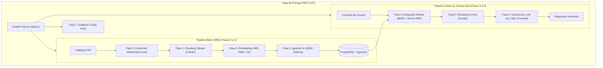

# RAG Multi-Proveedor: Procesamiento de Catálogos Industriales y API REST

Sistema de recuperación y generación aumentada (RAG) de grado productivo para catálogos técnicos industriales y ferreteros multi-proveedor. Integra extracción multimodal con OpenAI GPT-5.6 Luna, búsqueda híbrida densa/léxica con compresión Matryoshka (256d), reranking semántico Cross-Encoder, síntesis con citaciones verificadas y una API REST asíncrona construida sobre FastAPI.

---

## 🏗️ Arquitectura del Sistema



---

## 📁 Estructura del Proyecto (Scaffolding)

```text
super-warehouse-data-processing/
├── app/                              # Paquete central de la aplicación
│   ├── main.py                       # Fábrica FastAPI, middlewares, CORS y ciclo de vida
│   ├── config.py                     # Pydantic Settings y configuración centralizada
│   │
│   ├── api/                          # CAPA HTTP / REST API
│   │   ├── schemas/                  # DTOs Pydantic v2 (health, catalog, query, job, evaluation)
│   │   └── v1/                       # Routers y Controladores versionados
│   │       ├── router.py             # Agregador de rutas /api/v1
│   │       └── endpoints/            # health.py, catalogs.py, query.py, jobs.py, evaluate.py
│   │
│   ├── core/                         # CAPA DE DOMINIO Y LÓGICA RAG (Clean Architecture)
│   │   ├── orchestrator.py           # Orquestador Maestro (Fachada End-to-End)
│   │   ├── ingestion/                # Pipeline Batch: pdf_parser, chunker, embedder, vector_store
│   │   ├── retrieval/                # Pipeline Online: hybrid (BM25+Dense), reranker, generator
│   │   └── evaluation/               # Calidad Continua: evaluator (Tríada RAG)
│   │
│   └── services/                     # Servicios transversales
│       └── job_manager.py            # Gestor de tareas asíncronas en background
│
├── data/                             # Almacenamiento persistente y local
│   ├── raw_pdfs/                     # PDFs de catálogos originales (FN, AMX, PZ Force)
│   ├── uploads/                      # Archivos cargados vía API REST
│   └── artifacts/                    # JSONs intermedios generados (parsing, nodos, embeddings)
│
├── docs/                             # Documentación técnica
│   └── guides/                       # Guías de arquitectura de las Fases 0 a 7
│
├── tests/                            # Suite automatizada de pruebas
│   ├── test_api.py                   # Tests de integración de la API REST
│   └── test_rag_pipeline.py          # Tests unitarios del pipeline RAG
│
├── cli.py                            # CLI unificado (serve, ingest, query, evaluate, health)
├── pyproject.toml                    # Manifiesto estándar PEP 621 y dependencias
├── .env.example                      # Template de variables de entorno
└── pyrightconfig.json                # Configuración de type checking
```

---

## 🚀 Configuración y Puesta en Marcha

### 1. Variables de Entorno
Copia el archivo de ejemplo y completa tus credenciales:
```bash
cp .env.example .env
```
Variables requeridas en `.env`:
- `OPENAI_API_KEY`: Clave de API de OpenAI (para GPT-5.6 Luna, text-embedding-3-large y GPT-4o).
- `POSTGRES_USER`, `POSTGRES_PASSWORD`, `POSTGRES_HOST`, `POSTGRES_PORT`, `POSTGRES_DB` (o `DATABASE_URL`).

### 2. Entorno Virtual e Instalación de Dependencias
El proyecto utiliza el estándar moderno **PEP 621** (`pyproject.toml`):
```bash
python3 -m venv .venv
source .venv/bin/activate

# Instalación en modo editable (registra el comando 'rag-cli' en el PATH):
pip install -e .

# Opcional: incluir herramientas de test y desarrollo:
pip install -e ".[dev]"
```

---

## 🛠️ Guía de Comandos Típicos (CLI)

El sistema puede gestionarse utilizando `rag-cli` (instalado automáticamente en el PATH) o directamente con `python cli.py`:

### 1. Iniciar la API REST
Levanta el servidor local con soporte de recarga en caliente:
```bash
.venv/bin/python cli.py serve --port 8001 --reload
```
* Swagger UI interactivo: [http://localhost:8001/docs](http://localhost:8001/docs)
* ReDoc: [http://localhost:8001/redoc](http://localhost:8001/redoc)

### 2. Ingesta Batch de Catálogos PDF (Paso a Paso Automatizado)
Ejecuta secuencialmente **Fase 0 $\rightarrow$ Fase 1 $\rightarrow$ Fase 2 $\rightarrow$ Fase 3**:
```bash
# Ingesta completa creando/recreando la tabla:
.venv/bin/python cli.py ingest "data/raw_pdfs/LISTA AMX_2026.pdf" \
  --codigo-proveedor "AMX" \
  --nombre-proveedor "AMX Products" \
  --start-page 4 --max-pages 13 \
  --recreate-table

# Ingesta incremental de un segundo proveedor (sin --recreate-table):
.venv/bin/python cli.py ingest "data/raw_pdfs/CATÁLOGO PZ FORCE.pdf" \
  --codigo-proveedor "PZF" \
  --nombre-proveedor "PZ Force" \
  --start-page 1 --max-pages 9
```

### 3. Consultas en Tiempo Real (RAG Online)
Ejecuta la recuperación híbrida, reranker y generación con citas:
```bash
.venv/bin/python cli.py query "Llave de impacto 1/2 pulgada" --top-n 3

# Salida en JSON estructurado para integración con sistemas externos:
.venv/bin/python cli.py query "Llaves de impacto 3/4" --structured --json
```

### 4. Auditoría y Benchmark Continuo (Tríada RAG - Fase 7)
Evalúa el Golden Dataset y genera reportes en Markdown y JSON:
```bash
.venv/bin/python cli.py evaluate
```

### 5. Diagnóstico de Salud de la Infraestructura
```bash
.venv/bin/python cli.py health
```

---

## 🌐 Endpoints de la API REST y Ejemplos `curl`

| Método | Ruta | Descripción |
| :--- | :--- | :--- |
| `GET` | `/health` / `/api/v1/health` | Estado de conexión con Postgres, extensión `vector` e inventario. |
| `GET` | `/api/v1/catalogs` | Inventario consolidado y desglose de productos por proveedor. |
| `POST` | `/api/v1/catalogs/ingest-file` | Carga de archivo PDF (`multipart/form-data`) con procesamiento asíncrono. |
| `POST` | `/api/v1/catalogs/ingest-path` | Ingesta batch de un archivo PDF ubicado en el servidor. |
| `GET` | `/api/v1/jobs/{job_id}` | Consulta de progreso y resultado de tareas de fondo. |
| `POST` | `/api/v1/query` | Búsqueda semántica híbrida y generación LLM en tiempo real. |
| `POST` | `/api/v1/evaluate` | Ejecución bajo demanda de la suite de evaluación de la Tríada RAG. |

### Ejemplos de uso con `curl`

#### 1. Diagnóstico de Salud (`GET /api/v1/health`)
```bash
curl -X GET "http://localhost:8001/api/v1/health?table_name=catalogo_productos_rag"
```

#### 2. Inventario de Catálogos (`GET /api/v1/catalogs`)
```bash
curl -X GET "http://localhost:8001/api/v1/catalogs?table_name=catalogo_productos_rag"
```

#### 3. Ingesta por Subida de Archivo PDF (`POST /api/v1/catalogs/ingest-file`)
```bash
curl -X POST "http://localhost:8001/api/v1/catalogs/ingest-file" \
  -F "file=@data/raw_pdfs/LISTA AMX_2026.pdf" \
  -F "codigo_proveedor=AMX" \
  -F "nombre_proveedor=AMX Products" \
  -F "start_page=4" \
  -F "max_pages=13" \
  -F "table_name=catalogo_productos_rag" \
  -F "sync=false"
```

#### 4. Ingesta desde Ruta Local en Servidor (`POST /api/v1/catalogs/ingest-path`)
```bash
curl -X POST "http://localhost:8001/api/v1/catalogs/ingest-path" \
  -H "Content-Type: application/json" \
  -d '{
    "pdf_path": "data/raw_pdfs/CATÁLOGO PZ FORCE.pdf",
    "codigo_proveedor": "PZF",
    "nombre_proveedor": "PZ Force",
    "start_page": 1,
    "max_pages": 9,
    "table_name": "catalogo_productos_rag",
    "sync": false
  }'
```

#### 5. Consultar Estado de Trabajo Asíncrono (`GET /api/v1/jobs/{job_id}`)
```bash
curl -X GET "http://localhost:8001/api/v1/jobs/019c0b12-3456-789a-bcde-f0123456789a"
```

#### 6. Consulta Semántica RAG (`POST /api/v1/query`)
```bash
curl -X POST "http://localhost:8001/api/v1/query" \
  -H "Content-Type: application/json" \
  -d '{
    "query": "Llave de impacto 1/2 pulgada",
    "top_n": 3,
    "threshold": 0.45,
    "structured_json": true,
    "audit": false
  }'
```

#### 7. Evaluación de la Tríada RAG (`POST /api/v1/evaluate`)
```bash
curl -X POST "http://localhost:8001/api/v1/evaluate" \
  -H "Content-Type: application/json" \
  -d '{
    "table_name": "catalogo_productos_rag",
    "output_dir": "./data/evaluation"
  }'
```

---

## 🤖 Guía de Integración para Agentes Externos (Tools / Function Calling)

Este microservicio está optimizado para ser consumido como **Tool de Búsqueda y Validación de Catálogo** por sistemas agénticos externos (LangGraph, CrewAI, AutoGen, OpenAI Assistants, etc.) corriendo en la misma máquina o en red local.

### 1. Parámetros de Conexión Local

* **URL Base del Servidor:** `http://localhost:8001` (o el puerto configurado al levantar el servicio con `cli.py serve --port 8001`).
* **Endpoint Principal de Búsqueda RAG:** `POST /api/v1/query`
* **Esquema OpenAPI Completo:** `http://localhost:8001/openapi.json`
* **Swagger UI interactivo:** `http://localhost:8001/docs`

---

### 2. Definición Estándar de la Tool (JSON Schema)

Copia y registra la siguiente definición de herramienta en el LLM o framework del agente consumidor:

```json
{
  "name": "search_industrial_catalog",
  "description": "Busca especificaciones técnicas, precios, disponibilidad, medidas y códigos en los catálogos industriales utilizando recuperación híbrida (semántica + léxica BM25) y reranking. Usar SIEMPRE que se requiera validar un producto con el cliente o confeccionar una orden de compra.",
  "parameters": {
    "type": "object",
    "properties": {
      "query": {
        "type": "string",
        "description": "Texto de búsqueda técnica, código de artículo, modelo o descripción funcional (ej: 'llave de impacto 1/2 pulgada', 'AMX-AT-5044', 'abrazaderas cremallera 9/13')."
      },
      "top_n": {
        "type": "integer",
        "description": "Cantidad de productos finalistas a recuperar tras el reranking (recomendado: 2 a 5).",
        "default": 3
      },
      "structured_json": {
        "type": "boolean",
        "description": "Debe ser true para que la API devuelva la ficha técnica y comercial tipada en formato JSON.",
        "default": true
      }
    },
    "required": ["query"]
  }
}
```

---

### 3. Contrato de Entrada (Request)

```http
POST /api/v1/query
Content-Type: application/json

{
  "query": "Llave de impacto 1/2 pulgada",
  "top_n": 3,
  "threshold": 0.45,
  "structured_json": true
}
```

---

### 4. Contrato de Salida (Response)

La respuesta proyecta la **ficha completa del producto** para abastecer simultáneamente la **confirmación con el cliente** y la **confección de la orden de compra**:

```json
{
  "query": "Llave de impacto 1/2 pulgada",
  "response_text": "En base a la información técnica y comercial verificada en el catálogo:\n* **Llave de impacto neumática XMAX de 1/2\" AT-5044** (Código: `AMX-AT-5044` | Marca: XMAX | Precio: ARS 185,000.00 | Pág. 3): Encastre: 1/2 pulgada, Torque: 520 lb/ft (700 Nm), Velocidad: 7500 rpm. [Fragmento 1]",
  "is_refusal": false,
  "status": "SUCCESS",
  "citations": ["[Fragmento 1]"],
  "is_fully_grounded": true,
  "structured_json": {
    "respuesta_narrativa": "...",
    "consulta_respondida": true,
    "productos": [
      {
        "codigo": "AMX-AT-5044",
        "codigo_orig": "AT-5044",
        "codigo_proveedor": "AMX",
        "nombre_proveedor": "AMX Products",
        "marca": "XMAX",
        "nombre": "Llave de impacto neumática 1/2\"",
        "categoria_padre": "Herramientas Neumáticas",
        "categoria": "Llaves de Impacto",
        "subcategoria": "Encastre 1/2 pulgada",
        "precio": 185000.0,
        "moneda": "ARS",
        "unidad_venta": "c/u",
        "empaque": "Caja x 1",
        "especificaciones": "Encastre: 1/2 pulgada, Torque: 520 lb/ft (700 Nm), Velocidad: 7500 rpm, Conexión: 1/4 NPT",
        "archivo_origen": "LISTA AMX_2026.pdf",
        "pagina": 3,
        "fragmento_id": 1
      }
    ]
  },
  "context_chunks": [
    {
      "fragment_id": 1,
      "codigo_producto": "AMX-AT-5044",
      "marca": "XMAX",
      "pagina": 3,
      "archivo_origen": "LISTA AMX_2026.pdf",
      "content": "archivo_origen: LISTA AMX_2026.pdf\nproveedor: AMX Products\ncodigo: AMX-AT-5044\n..."
    }
  ],
  "total_latency_ms": 1250.4,
  "model_name": "gpt-4o"
}
```

#### Mapeo de Campos para el Agente Consumidor:
* **Para Confirmar con el Cliente:** `nombre`, `marca`, `especificaciones`, `archivo_origen`, `pagina` (referencia visual directa del PDF).
* **Para el Pedido / ERP:** `codigo` (SKU del negocio), `codigo_orig` (código de fábrica), `codigo_proveedor`, `precio`, `moneda`, `unidad_venta`, `empaque`.
* **Manejo de Ausencia:** Si un producto no existe o está agotado, `is_refusal` es `true`, `structured_json.consulta_respondida` es `false` y `productos` es una lista vacía `[]`.

---

### 5. Ejemplo de Integración en Python (Cliente Agéntico)

```python
import httpx

RAG_API_URL = "http://localhost:8001/api/v1/query"

def search_catalog_tool(query: str, top_n: int = 3) -> dict:
    """Función de ejecución de la Tool para agentes en Python."""
    payload = {
        "query": query,
        "top_n": top_n,
        "structured_json": True
    }
    with httpx.Client(timeout=15.0) as client:
        response = client.post(RAG_API_URL, json=payload)
        response.raise_for_status()
        data = response.json()
        
        # Retorna el JSON estructurado con la lista de productos
        return data.get("structured_json") or {
            "consulta_respondida": False,
            "respuesta_narrativa": data.get("response_text", ""),
            "productos": []
        }

# Prueba directa
if __name__ == "__main__":
    result = search_catalog_tool("Llave de impacto 1/2 pulgada")
    print(f"¿Respondida?: {result['consulta_respondida']}")
    for prod in result.get("productos", []):
        print(f"- {prod['codigo']}: {prod['nombre']} | {prod['moneda']} {prod['precio']} (Pág. {prod['pagina']} de {prod['archivo_origen']})")
```

---

## 🧪 Ejecución de Pruebas Automatizadas

```bash
.venv/bin/python -m unittest discover -s tests
```
Incluye pruebas de integración sobre todos los endpoints REST y pruebas unitarias de recuperación del orquestador.

---

## 📚 Documentación Técnica Detallada

Las guías paso a paso de cada fase se encuentran en `docs/guides/`:
- [Fase 0: Ingesta y Parsing Multimodal con Luna](docs/guides/fase-0-ingesta-limpieza-estructural-v2.md)
- [Fase 1: Estrategia de Segmentación y Chunking Tabular](docs/guides/fase-1-estrategia-segmentacion-v2.md)
- [Fase 2: Generación de Embeddings Matryoshka (MRL 256d) y QA](docs/guides/fase-2-generacion-embeddings.md)
- [Fase 3: Infraestructura e Indexación Vectorial HNSW en pgvector](docs/guides/fase-3-infraestructura-indexacion-v2.md)
- [Fase 4: Recuperación Híbrida Léxica y Densa con RRF](docs/guides/fase-4-recuperacion-hibrida-rrf.md)
- [Fase 5: Re-ordenamiento Semántico y Compresión de Contexto](docs/guides/fase-5-reordenamiento-compresion.md)
- [Fase 6: Generación Aumentada con Citas y Control de Alucinaciones](docs/guides/fase-6-generacion-aumentada-sintesis.md)
- [Fase 7: Evaluación Continua de la Tríada RAG y Quality Gate](docs/guides/fase-7-evaluacion-continua-triada-rag-v2.md)
