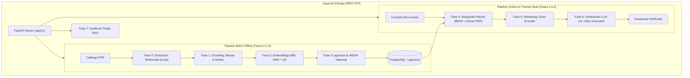

# RAG Multi-Proveedor: Procesamiento de Catálogos Industriales y API REST

Sistema de recuperación y generación aumentada (RAG) de grado productivo para catálogos técnicos industriales y ferreteros multi-proveedor. Integra extracción multimodal con OpenAI GPT-5.6 Luna, búsqueda híbrida densa/léxica con compresión Matryoshka (256d), reranking semántico Cross-Encoder, síntesis con citaciones verificadas y una API REST asíncrona construida sobre FastAPI.

---

## 🏗️ Arquitectura del Sistema



---

## 📁 Estructura del Proyecto (Scaffolding)

```text
super-warehouse-data-processing/
├── app/                              # Paquete central de la aplicación
│   ├── main.py                       # Fábrica FastAPI, middlewares, CORS y ciclo de vida
│   ├── config.py                     # Pydantic Settings y configuración centralizada
│   │
│   ├── api/                          # CAPA HTTP / REST API
│   │   ├── schemas/                  # DTOs Pydantic v2 (health, catalog, query, job, evaluation)
│   │   └── v1/                       # Routers y Controladores versionados
│   │       ├── router.py             # Agregador de rutas /api/v1
│   │       └── endpoints/            # health.py, catalogs.py, query.py, jobs.py, evaluate.py
│   │
│   ├── core/                         # CAPA DE DOMINIO Y LÓGICA RAG (Clean Architecture)
│   │   ├── orchestrator.py           # Orquestador Maestro (Fachada End-to-End)
│   │   ├── ingestion/                # Pipeline Batch: pdf_parser, chunker, embedder, vector_store
│   │   ├── retrieval/                # Pipeline Online: hybrid (BM25+Dense), reranker, generator
│   │   └── evaluation/               # Calidad Continua: evaluator (Tríada RAG)
│   │
│   └── services/                     # Servicios transversales
│       └── job_manager.py            # Gestor de tareas asíncronas en background
│
├── data/                             # Almacenamiento persistente y local
│   ├── raw_pdfs/                     # PDFs de catálogos originales (FN, AMX, PZ Force)
│   ├── uploads/                      # Archivos cargados vía API REST
│   └── artifacts/                    # JSONs intermedios generados (parsing, nodos, embeddings)
│
├── docs/                             # Documentación técnica
│   └── guides/                       # Guías de arquitectura de las Fases 0 a 7
│
├── tests/                            # Suite automatizada de pruebas
│   ├── test_api.py                   # Tests de integración de la API REST
│   └── test_rag_pipeline.py          # Tests unitarios del pipeline RAG
│
├── cli.py                            # CLI unificado (serve, ingest, query, evaluate, health)
├── pyproject.toml                    # Manifiesto estándar PEP 621 y dependencias
├── .env.example                      # Template de variables de entorno
└── pyrightconfig.json                # Configuración de type checking
```

---

## 🚀 Configuración y Puesta en Marcha

### 1. Variables de Entorno
Copia el archivo de ejemplo y completa tus credenciales:
```bash
cp .env.example .env
```
Variables requeridas en `.env`:
- `OPENAI_API_KEY`: Clave de API de OpenAI (para GPT-5.6 Luna, text-embedding-3-large y GPT-4o).
- `POSTGRES_USER`, `POSTGRES_PASSWORD`, `POSTGRES_HOST`, `POSTGRES_PORT`, `POSTGRES_DB` (o `DATABASE_URL`).

### 2. Entorno Virtual e Instalación de Dependencias
El proyecto utiliza el estándar moderno **PEP 621** (`pyproject.toml`):
```bash
python3 -m venv .venv
source .venv/bin/activate

# Instalación en modo editable (registra el comando 'rag-cli' en el PATH):
pip install -e .

# Opcional: incluir herramientas de test y desarrollo:
pip install -e ".[dev]"
```

---

## 🛠️ Guía de Comandos Típicos (CLI)

El sistema puede gestionarse utilizando `rag-cli` (instalado automáticamente en el PATH) o directamente con `python cli.py`:

### 1. Iniciar la API REST
Levanta el servidor local con soporte de recarga en caliente:
```bash
.venv/bin/python cli.py serve --port 8000 --reload
```
* Swagger UI interactivo: [http://localhost:8000/docs](http://localhost:8000/docs)
* ReDoc: [http://localhost:8000/redoc](http://localhost:8000/redoc)

### 2. Ingesta Batch de Catálogos PDF (Paso a Paso Automatizado)
Ejecuta secuencialmente **Fase 0 $\rightarrow$ Fase 1 $\rightarrow$ Fase 2 $\rightarrow$ Fase 3**:
```bash
# Ingesta completa creando/recreando la tabla:
.venv/bin/python cli.py ingest "data/raw_pdfs/LISTA AMX_2026.pdf" \
  --codigo-proveedor "AMX" \
  --nombre-proveedor "AMX Products" \
  --start-page 4 --max-pages 13 \
  --recreate-table

# Ingesta incremental de un segundo proveedor (sin --recreate-table):
.venv/bin/python cli.py ingest "data/raw_pdfs/CATÁLOGO PZ FORCE.pdf" \
  --codigo-proveedor "PZF" \
  --nombre-proveedor "PZ Force" \
  --start-page 1 --max-pages 9
```

### 3. Consultas en Tiempo Real (RAG Online)
Ejecuta la recuperación híbrida, reranker y generación con citas:
```bash
.venv/bin/python cli.py query "Llave de impacto 1/2 pulgada" --top-n 3

# Salida en JSON estructurado para integración con sistemas externos:
.venv/bin/python cli.py query "Llaves de impacto 3/4" --structured --json
```

### 4. Auditoría y Benchmark Continuo (Tríada RAG - Fase 7)
Evalúa el Golden Dataset y genera reportes en Markdown y JSON:
```bash
.venv/bin/python cli.py evaluate
```

### 5. Diagnóstico de Salud de la Infraestructura
```bash
.venv/bin/python cli.py health
```

---

## 🌐 Endpoints de la API REST

| Método | Ruta | Descripción |
| :--- | :--- | :--- |
| `GET` | `/health` / `/api/v1/health` | Estado de conexión con Postgres, extensión `vector` e inventario. |
| `GET` | `/api/v1/catalogs` | Inventario consolidado y desglose de productos por proveedor. |
| `POST` | `/api/v1/catalogs/ingest-file` | Carga de archivo PDF (`multipart/form-data`) con procesamiento asíncrono. |
| `POST` | `/api/v1/catalogs/ingest-path` | Ingesta batch de un archivo PDF ubicado en el servidor. |
| `GET` | `/api/v1/jobs/{job_id}` | Consulta de progreso y resultado de tareas de fondo. |
| `POST` | `/api/v1/query` | Búsqueda semántica híbrida y generación LLM en tiempo real. |
| `POST` | `/api/v1/evaluate` | Ejecución bajo demanda de la suite de evaluación de la Tríada RAG. |

---

## 🧪 Ejecución de Pruebas Automatizadas

```bash
.venv/bin/python -m unittest discover -s tests
```
Incluye pruebas de integración sobre todos los endpoints REST y pruebas unitarias de recuperación del orquestador.

---

## 📚 Documentación Técnica Detallada

Las guías paso a paso de cada fase se encuentran en `docs/guides/`:
- [Fase 0: Ingesta y Parsing Multimodal con Luna](docs/guides/fase-0-ingesta-limpieza-estructural-v2.md)
- [Fase 1: Estrategia de Segmentación y Chunking Tabular](docs/guides/fase-1-estrategia-segmentacion-v2.md)
- [Fase 2: Generación de Embeddings Matryoshka (MRL 256d) y QA](docs/guides/fase-2-generacion-embeddings.md)
- [Fase 3: Infraestructura e Indexación Vectorial HNSW en pgvector](docs/guides/fase-3-infraestructura-indexacion-v2.md)
- [Fase 4: Recuperación Híbrida Léxica y Densa con RRF](docs/guides/fase-4-recuperacion-hibrida-rrf.md)
- [Fase 5: Re-ordenamiento Semántico y Compresión de Contexto](docs/guides/fase-5-reordenamiento-compresion.md)
- [Fase 6: Generación Aumentada con Citas y Control de Alucinaciones](docs/guides/fase-6-generacion-aumentada-sintesis.md)
- [Fase 7: Evaluación Continua de la Tríada RAG y Quality Gate](docs/guides/fase-7-evaluacion-continua-triada-rag-v2.md)
