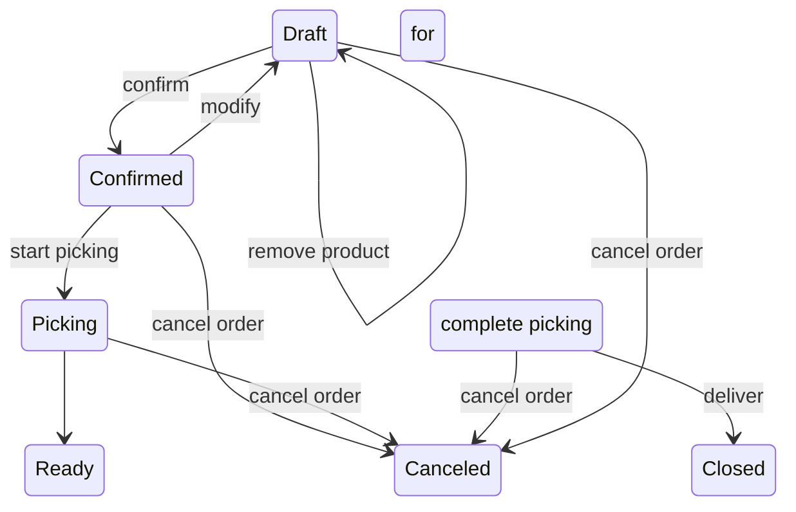

# Estado del Pedido — Diagrama Objetivo y Evaluación de la Implementación

Documento de referencia del ciclo de vida de un pedido de cliente. Contiene el
diagrama de estados objetivo y la evaluación de conformidad de la implementación
actual (revisión sobre commit `404a1b2`, 2026-09-04).

## Diagrama de estados objetivo

## Decisiones de diseño (2026-09-04)

Decididas con el dueño del producto al alinear la implementación con el diagrama:

1. **El borrador (`Draft`) se persiste en base.** Se puede agregar o quitar
   productos en momentos distintos, por lo que ya no puede ser solo estado en
   memoria.
2. **Invariante: un solo pedido `Draft` por cliente.** No pueden coexistir dos
   borradores para el mismo cliente al mismo tiempo.
3. **Los estados se renombran** para adoptar los nombres del diagrama:
   `Draft`, `Confirmed`, `Picking`, `Ready for delivery`, `Canceled`, `Closed`.
4. **Picking y entrega los dispara el dueño u otro integrante del negocio**
   (el encargado de depósito), por chat o por backoffice. La primera
   implementación se hace por backoffice.
5. **La aprobación del dueño se mueve al `confirm`** (`Draft → Confirmed`).
   Ahí corren el guard de TTL, el append a Google Sheets (con cuarentena) y el
   descuento de stock. El diagrama queda canónico, sin estados ocultos.
6. **El cliente se resuelve o crea al agregar el primer producto.** El Draft
   persistido nace con `customer_id` resuelto, y la invariante de un solo
   Draft por cliente se apoya en esa columna.

## Mapeo con la implementación actual

| Estado del diagrama | Implementación actual | Evidencia |
|---|---|---|
| `Draft` | Solo en memoria: `ConversationState.draft_items`. Nunca se persiste; no existe estado `Draft` en la base. | `src/orchestrator/session.py:97` |
| `Confirmed` | `OrderEstado.PENDING_APPROVAL` (se crea al finalizar el borrador). | `src/db/models.py:50-56`, `src/sourcing/draft_order.py:42` |
| `Picking` | Sin equivalente directo. Lo más cercano es `SourcingState.IN_PREPARATION`, pero es un eje independiente que solo se asigna al crear el pedido. | `src/db/models.py:59-69`, `src/sourcing/case_b.py:53` |
| `Ready for delivery` | Aproximación: `OrderEstado.APPROVED` (pedido aprobado, stock deducido). No existe un estado explícito de "listo para entrega". | `src/order_lifecycle/state.py:80` |
| `Closed` | Aproximación: `OrderEstado.IN_DISPATCH`. La transición existe (`mark_dispatched`) pero no tiene ningún llamador en producción. | `src/order_lifecycle/state.py:110-116` |
| `Canceled` | `OrderEstado.REJECTED` (solo desde `PENDING_APPROVAL`) + `SourcingState.CANCELLED` para el caso C. | `src/order_lifecycle/state.py:87-107`, `src/sourcing/case_c.py:41` |

## Evaluación transición por transición

| Transición del diagrama | Estado | Evidencia |
|---|---|---|
| `Draft → Draft : add product` | ✅ Implementada | El add determinístico agrega a `draft_items`: `src/agents/customer.py:921` |
| `Draft → Draft : remove product` | ❌ No implementada | No existe comando de quitar producto. `draft_items` solo se agrega o se limpia por completo al finalizar / resetear sesión: `src/agents/customer.py:641`, `src/orchestrator/router.py:157` |
| `Draft → Confirmed : confirm` | ⚠️ Parcial | El finalize persiste el borrador y crea el `Order` en `PENDING_APPROVAL`. Pero `Draft` no es un estado persistido: es una creación de registro, no una transición entre estados de base. | `src/agents/customer.py:617-644`, `src/sourcing/draft_order.py:28-79` |
| `Confirmed → Draft : modify` | ❌ No implementada | `PENDING_APPROVAL` no puede volver a borrador. Las únicas salidas son aprobar o rechazar. | `src/order_lifecycle/state.py:74-75, 93-94` |
| `Confirmed → Picking : start picking` | ❌ No implementada | No existe estado de picking ni transición hacia él. `IN_PREPARATION` se asigna solo en la creación del caso B, nunca como transición desde otro estado. | `src/sourcing/case_b.py:53, 101` |
| `Confirmed → Canceled : cancel order` | ✅ Implementada | `reject_order`: `PENDING_APPROVAL → REJECTED` con liberación inmediata de reservas. | `src/order_lifecycle/state.py:87-107` |
| `Picking → Ready for delivery : complete picking` | ❌ No implementada | Los estados no existen. |
| `Picking → Canceled : cancel order` | ❌ No implementada | Un pedido en `IN_PREPARATION` no se puede cancelar a nivel de `OrderEstado`. |
| `Ready for delivery → Closed : deliver` | ⚠️ Parcial | Existe `APPROVED → IN_DISPATCH` (`mark_dispatched`), pero es código muerto: ningún flujo de producción lo invoca, y `IN_DISPATCH` no tiene salida a un estado "Closed" terminal. | `src/order_lifecycle/state.py:110-116` |
| `Ready for delivery → Canceled : cancel order` | ❌ No implementada | `reject_order` rechaza explícitamente cancelar un pedido que no está en `PENDING_APPROVAL`. Un pedido `APPROVED` o `IN_DISPATCH` no se puede cancelar. | `src/order_lifecycle/state.py:93-94` |
| `Draft → Canceled : cancel order` | ❌ No implementada | El borrador es efímero: expira por TTL de la sesión, sin estado de cancelación explícito. | `src/orchestrator/session.py:97` |

## Brechas principales

1. **`Draft` no es un estado de base.** El borrador vive solo en memoria y expira con la sesión. No hay registro, ni cancelación, ni modificación persistida del borrador.
2. **No existe "remove product".** El borrador solo acumula líneas; para corregir hay que resetear la sesión completa ("Hola Bob").
3. **No existen los estados `Picking` ni `Ready for delivery`.** La implementación modela cuatro estados de aprobación + un eje de sourcing separado (`SourcingState`) que solo se asigna una vez y no tiene transiciones propias.
4. **`IN_DISPATCH` no está cableado.** `mark_dispatched` no tiene llamador en producción; ningún flujo mueve un pedido aprobado hacia la entrega, y no existe estado `Closed`.
5. **No se puede cancelar después de aprobar.** El guard de `reject_order` limita la cancelación a `PENDING_APPROVAL`; el diagrama permite cancelar desde `Picking` y desde `Ready for delivery`.
6. **No existe "modify" después de confirmar.** Una vez persistido el pedido, la única vía de cambio es rechazarlo y armar uno nuevo.

## Conceptos de la implementación que el diagrama no contempla

- `needs_requote` + TTL de reservas: un pedido con reservas vencidas no se puede aprobar sin re-cotizar (`RequiresRequoteError`). El diagrama no modela vencimiento. | `src/order_lifecycle/state.py:48-62`
- Eje `SourcingState` (PENDING_ASSEMBLY / IN_PREPARATION / CANCELLED), independiente de los estados de aprobación. | `src/db/models.py:59-69`
- Máquina de estados de órdenes de compra a proveedores (`SupplierPurchaseOrderState`), separada. | `src/db/models.py:72-79`, `src/purchasing/state.py`
- Cuarentena de Google Sheets: si la escritura falla, la aprobación se revierte y el pedido queda `PENDING_APPROVAL`. | `src/orchestrator/approval.py:153-156`

## Referencias

- Máquina de estados implementada (documentación actual): `docs/architecture.md` (sección "State machine")
- Enum de estados: `src/db/models.py:50-56`
- Transiciones y guardas: `src/order_lifecycle/state.py`
- Borrador en memoria: `src/orchestrator/session.py`, `src/agents/customer.py`
- Persistencia del borrador: `src/sourcing/draft_order.py`
- Spec vigente (OpenSpec): `openspec/specs/order-lifecycle/spec.md` ("Track order state machine")
- Tests de transiciones: `tests/test_order_lifecycle.py`, `tests/test_dispatch.py`, `tests/test_finalize.py`, `tests/test_case_a.py`, `tests/test_case_b.py`, `tests/test_case_c.py`
