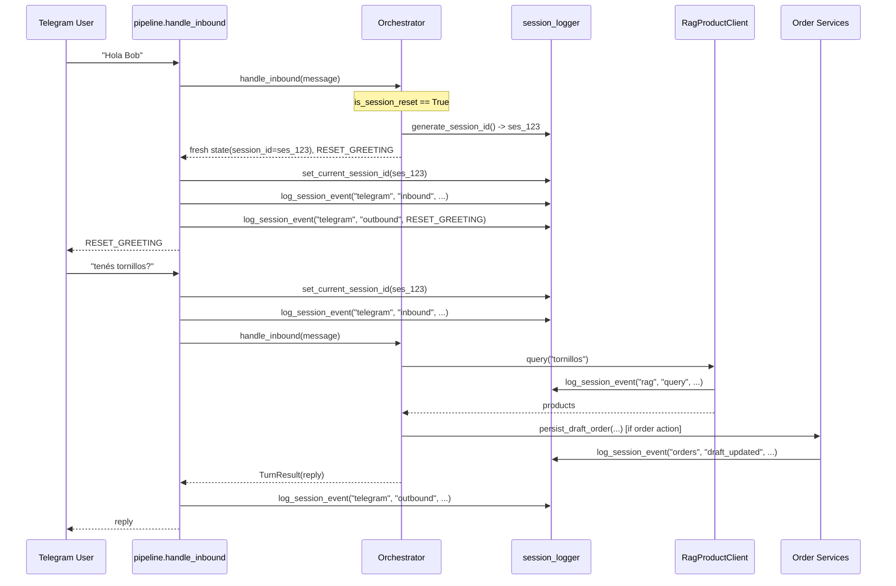

# Design: Log por Sesión de Telegram

## Technical Approach

Introduce a dedicated `src/observability/session_logger.py` module leveraging Python's `contextvars` to maintain the active `session_id` throughout inbound request processing. The `Orchestrator` generates a new `session_id` whenever "Hola Bob" arrives (matching `is_session_reset`), storing it in `ConversationState`. Services (`pipeline`, `RagProductClient`, `draft_order`) emit structured events via `log_session_event`, which writes synchronously to an append-only file per session under `logs/sessions/{session_id}.log`.

## Architecture Decisions

| Decision | Alternatives | Rationale |
|---|---|---|
| Trace context via `contextvars.ContextVar` | Explicit parameter passing down every call chain | Non-invasive: services like `RagProductClient` or `persist_draft_order` do not need signature changes in order to record session context. |
| File-per-session storage (`logs/sessions/{session_id}.log`) | Single shared log file or Database table | Isolates session traces into self-contained files, simple to inspect, zero migration overhead, and no contention across sessions. |
| Structured JSON-line or key-value format | Plain freeform text | Enables programmatic parsing (e.g. for Backoffice viewer) and human reading via `tail -f` or editors. |
| Session initiation on "Hola Bob" with fallback auto-generation | Require "Hola Bob" or reject | Strict compliance with user requirement while guaranteeing that messages prior to any reset still carry a valid traceable session ID. |
| Backoffice integration: lightweight log viewer | External tool (e.g. Grafana, Seq) | Self-contained in existing Gradio app; zero external infrastructure dependencies. |

## Sequence Diagram



## File Changes

| File | Action | Description |
|---|---|---|
| `src/observability/__init__.py` | Create | Package initialization and public exports. |
| `src/observability/session_logger.py` | Create | `ContextVar`, session ID generator, event logger, and session file writer. |
| `src/orchestrator/session.py` | Modify | Add `session_id: str | None = None` to `ConversationState`. |
| `src/orchestrator/router.py` | Modify | Generate and attach `session_id` on reset and ensure active session persistence. |
| `src/pipeline.py` | Modify | Set `current_session_id` context, log inbound/outbound Telegram messages and routing decisions. |
| `src/integrations/rag.py` | Modify | Emit trace events on `query` and `price_lookup` with latency, status, and product count. |
| `src/sourcing/draft_order.py` | Modify | Emit trace events on draft creation, item addition and removal. |
| `src/backoffice/sessions.py` | Create | Helpers to list and read session log files. |
| `src/backoffice/app.py` | Modify | Add "Sesiones" tab in Gradio to inspect traces. |
| `tests/test_session_logger.py` | Create | Unit tests for logger, context variable, and file writing. |
| `tests/test_pipeline_session_trace.py` | Create | End-to-end integration test verifying multi-turn session trace. |

## Interfaces / Contracts

```python
# src/observability/session_logger.py

current_session_id: ContextVar[str | None]

def generate_session_id(sender_id: str) -> str:
    """Generate unique session ID: ses_{YYYYMMDD_HHMMSS}_{short_uuid}."""

def set_current_session_id(session_id: str | None) -> contextvars.Token:
    """Set active session ID for the current async context."""

def get_current_session_id() -> str | None:
    """Return the active session ID if set."""

def log_session_event(
    service: str,
    action: str,
    details: dict[str, Any] | None = None,
    *,
    session_id: str | None = None,
    level: str = "INFO",
) -> None:
    """Append a structured trace line to logs/sessions/{session_id}.log."""
```
